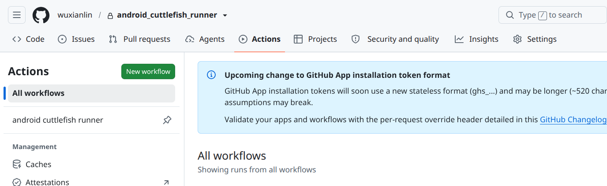
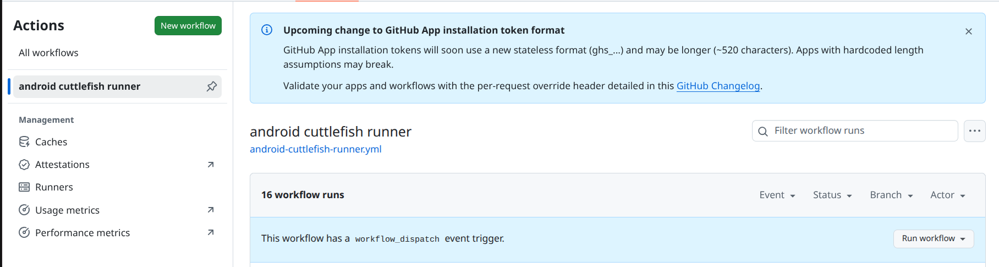
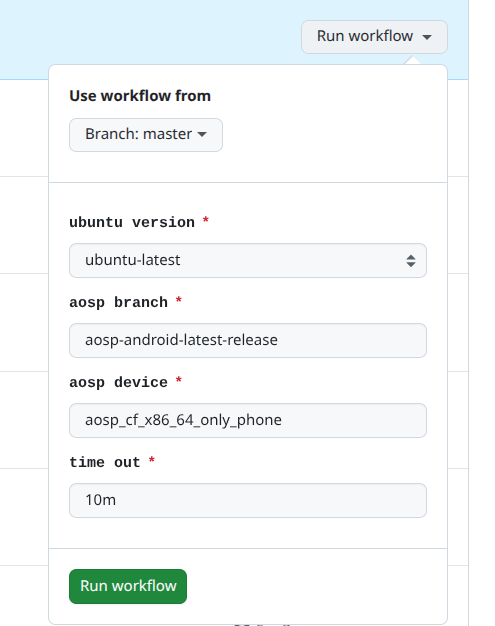
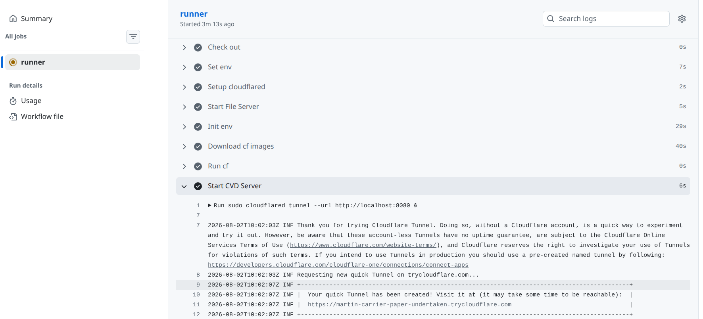
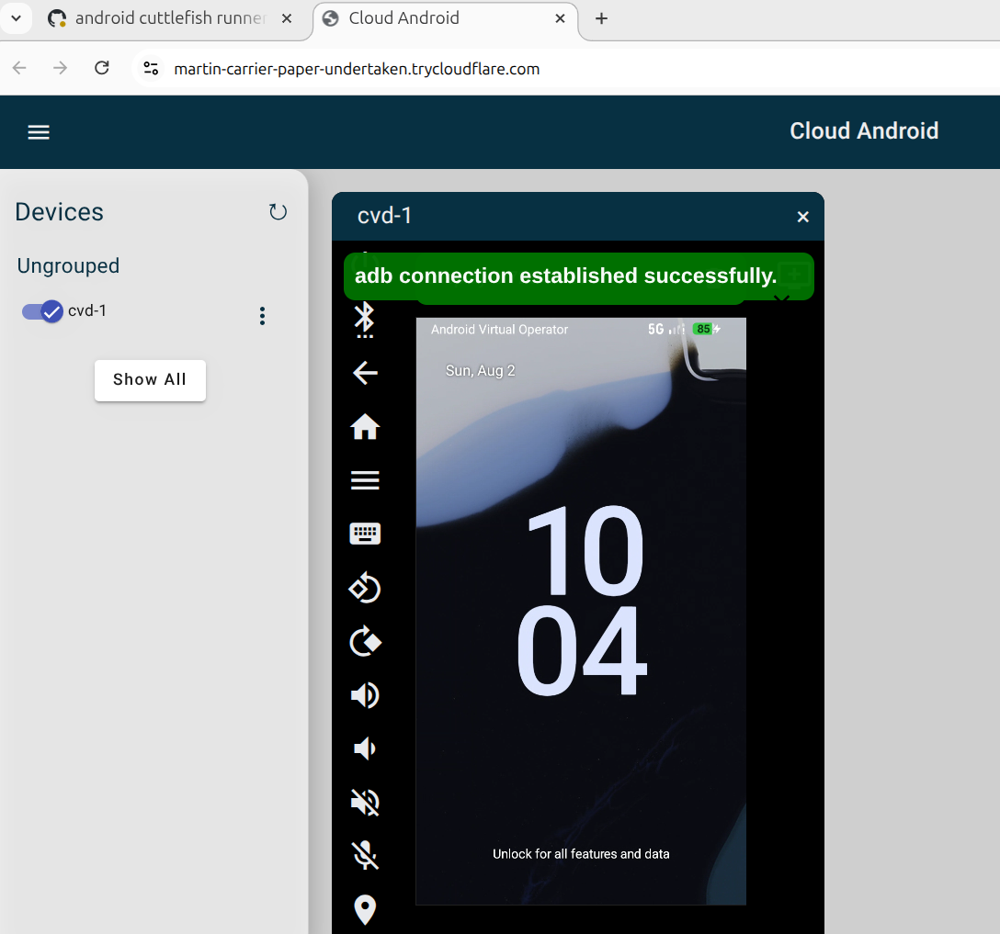

Run Cuttlefish virtual Android with github action
=============================================================

Features
========
- Supports running x86_64 Cuttlefish virtual Android on x86_64 Ubuntu.
- Supports running arm64 Cuttlefish virtual Android on arm64(aarch64) Ubuntu.

Guide
======
1. Fork this repo
1. Go to the **Action** tab in your forked repo
    
1. In the left sidebar, click the **android cuttlefish runner** workflow
    
1. Above the list of workflow runs, select **Run workflow**
1. Input your config params, referring to the information on the Android CI website. then click **Run workflow**
    
1. Wait for the **Start CVD Server** step to complete and get temp cloudflare url from the log
    
1. Start the cloudflare url you got and enjoy CVD from WebUI
    

## Reference

- [Cuttlefish virtual Android](https://source.android.com/docs/devices/cuttlefish): Introduction to Cuttlefish virtual Android
- [Android CI](https://ci.android.com/): Android CI Builds
